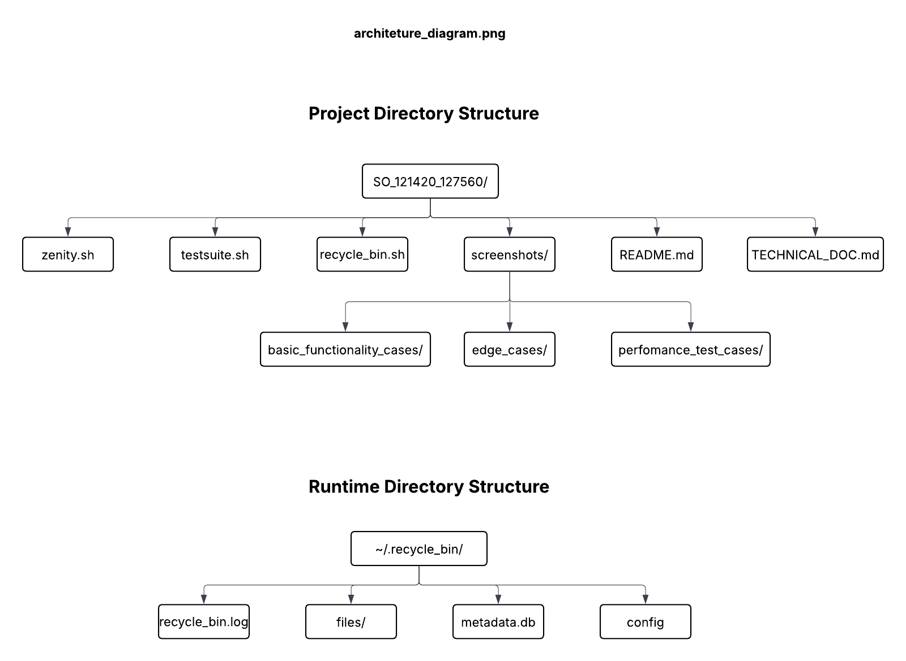
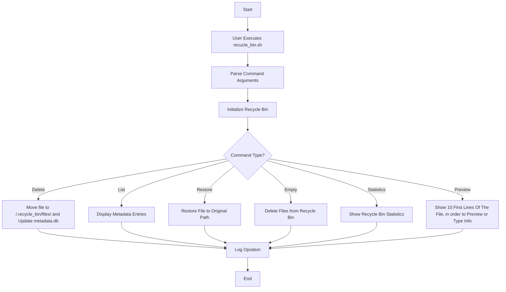

# Technical Documentation

**Projeto:** 121420_127560_RecycleBin 
**Curso:** Sistemas Operativos(SO)
**Versão do documento:** 1.0
**Data:** Outubro de 2025
**Autores:** Kelvin Loforte <kelvin.loforte@ua.pt> e Mario Santos <mariosantos1@ua.pt>
**Descrição:** Ferramenta de reciclagem que guardar ficheiros eliminados, permite listar, pré-visualizar e restaurar.

Este documento descreve a arquitetura, fluxo de dados, funções principais, decisões de design e manuntenção do sistema **Recycle Bin**, desenvolvido em **Bash**.

N.b.: "Decidimos continuar em inglês, para não haver confusão na interpretação".

## System Architecture
O sistema é composto por um conjunto de scripts shell responsáveis por simular uma reciclagem de ficheiros no ambiente Linux (similar ao Recycle bin do Windows). Durante a execução(Runtime Directory Structure) o sistema cria o diretóro oculto "~/.recycle_bin/" que armazena ficheiros eliminados, metadados e logs. 

**Abaixo demostramos a arquitetura do sistema(feito no LucidChart):** 



## Data Flow\
### Input Processing
- User interacts with the main script **recycle_bin.sh** via command-line commands.
- The first argument determines the operation (delete, list, restore, search, etc).
- The script validates user inputs (file existence, permissions, and arguments).
- Each file targeted for deletion is assigned a unique ID (timestamp-based).
- Metadata such as filename, path, type, size, and permissions are recorded in metadata.db.

### Processing Pipeline
- Stage 1: **Initialization -** checks if **~/.recycle_bin/** exists; creats it if not.
- Stage 2: **Operation Execution-** calls the corresponding function based on the user command.
- Stage 3: **Logging and Metadata Update-** logs actions and uupdates **metadata.db**.

### Output Generation
- Generates terminal messages for user feedback (ex.: "File deleted successfully").
- list, search and statistics commands outpt formatted tables.
- Optional visual output (via Zenity) may display graphical dialogs for some operations.

## Metadata Schema
### Core Elements
Each deleted fill has a corresponding entry in the **metadata.db (CSV format)**:

**. ID,ORIGINAL_NAME,ORIGINAL_PATH,DELETION_DATE,FILE_SIZE,FILE_TYPE,PERMISSIONS,OWNER**

- ID: Unique identifier generated by timestampo and random suffix
- ORIGINAL_NAME: originl filename before deletion 
- ORIGINAL_PATH: absolute path to where the file was located
- DELETION_DATE: Timestamp of deletion
- FILE_SIZE: size in bytes or KB
- FILE_TYPE: "file" or "directory"
- PERMISSIONS: orginal fiile permissions
- OWNER: file owner and group

### Extended Properties
- Version: Schema version 1.0
- Owner: Data owner
- Access Level: Security classification

## Key Functions
### Function: delete_file()
Purpose: Moves files or directories to the recycle bin.
Parameters: Files, paths to delete.
Returns: Updates metadata database and logs deletion event.
Process:
    1. Validate existence and permissions.
    2.  Generate unique ID and move file to **~/recycle_bin/files/**
    3. Append metadata entry to **metadata.db**
    4. Log operation in **recyle_bin.log**

### Function: list_recycled()
Purpose: Displays current contents of the recycle bin.
Parameters: Optioal flags **--detailed** or **--sort**.
Returns: Formatted list of entries from **metadata.db**.

### Function: restore_file()
Purpose: Restores a deleted file to its originsl location.
Parameters:Filename or unique ID.
Returns: File restored and corresponding metadata entry removed.

### Function: search_recycled()
Purpose: Searches **metadata.db** for files matching a name pattern.
Parameters: Search term or wildcard.
Returns: Matching entries from **metadata.db**.

### Function: empty_recyclebin()
Purpose: Permanntly removes files from recycle bin.
Parameters: Optional file ID or **--force** flag.
Returns: Deletes files from **files/** and removes metadata entries.

### Function: show_statistics()
Purpose: Displays genral statistics (total files, total size, oldest/newest).
Parameters: no parameters
Returns: summary table in terminal.

### Function: preview_file()
Purpose: Displays the first 10 lines of text files or MIME type for binaries.
Parameters: File ID.
Returns: Formatted preview output.

## Design Decisions
### Technology Stack
**- Language:** Bash Shell

**- Selected technologies:**
    - Tools: awk, sed, grep, file, stat, date, and zenity.

**- Justification for choices:**
    - Ensures portability and minin«mal dependencies.
    - Fully compatible with Unix/Linux environments.
    - Simple intgration with existing shell workflows.

**- Trade-offs considered:**
    - Limited performance on large datasets.
    - More complex error handling compared to higher-level languages.

### Architecture Patterns
**- Applied patterns:** Command Dispatcher (main uses **case** to dispatch commands).
**- Benefits:**
    - Easy to add new commands.
    - Clear separation on logic per operation.

**- Implementation details:**
    - Each user command correponds to a dedicated Bash function.
    - Logging and initialization are centralized for all commands.

## Algorithms
### Main Processing Algorithm
1. Parse command-line arguments.
2. Initialize recycle bin directories if missing.
3. Dispatch command to corresponding function.
4. Perform file operation (delete, restore, etc...).
5. Update logs and metadata.
6. Return status message.

### Optimization Techniques
- Caching strategy: Simple in-memory reuse of config variables.
- Performance improvements: Avoid unnecessary disk reads; use lightweight commands.
- Resource management: Automatic cleanup for old file (via **cleanup** command).

## Flow Charts
### Main Process Flow


### Error Handling Flow
```mermaid
graph TD
    A[Error Detected] --> B[Log Error to recycle_bin.log]
    B --> C[Display User-Friendly Message]
    C --> D{Recoverable?}
    D -->|yes| E[Retry or Fallback Action]
    D -->|no|  F[Abort Operation]
```

## Maintenance
### Monitoring
**- Key metrics:**
    - Number of files in recycle bin
    - Total space usage
    - Oldest file age

**- Alert thresholds:**
    - If bin size > MAX_SIZE_MB -> trigger cleanup.

**- Logging strategy:**
    - All actions logged to **recycle-bin-log** with timestamp and status.

### Troubleshooting
**- Common issues:**
    - File not found: Verify ID or path.
    - Permission denied: Run with correct permissions.
    - Restore failure: Destination path may not exist or be read-only.

**- Resolution steps:**
    - Recreate **/.recycled_bin/** if corrupted.
    - Check **metadata.db** for missing entries.
    - Use **empty --force** to reste state.

**- Support contacts**
    - Kelvin Loforte - <kelvin.loforte@ua.pt>
    - Mario Santos - <mariosantos1@ua.pt>
