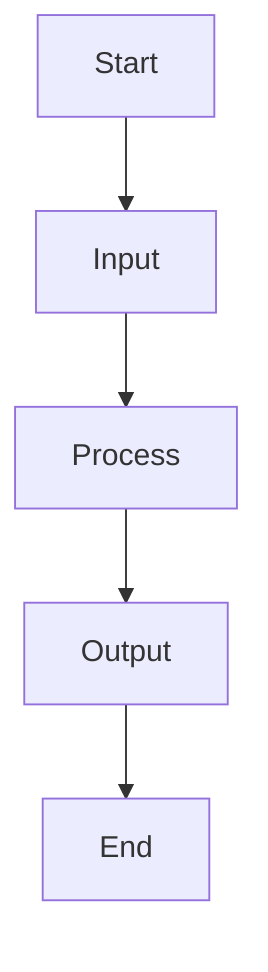
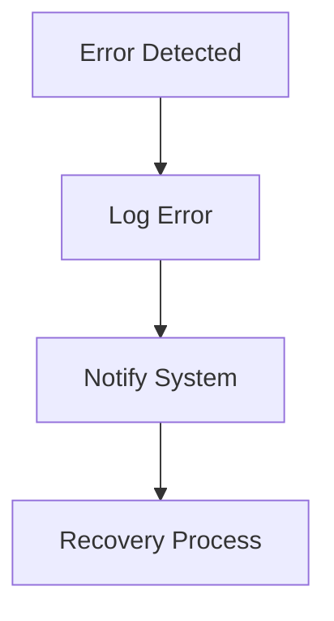

# Technical Documentation

**Projeto:** 121420_127560_RecycleBin 
**Curso:** Sistemas Operativos(SO)
**Versão do documento:** 1.0
**Data:** Outubro de 2025
**Autores:** Kelvin Loforte <kelvin.loforte@ua.pt> e Mario Santos <mariosantos1@ua.pt>
**Descrição:** Ferramenta de reciclagem que guardar ficheiros eliminados, permite listar, pré-visualizar e restaurar.

## System Architecture

## Data Flow\
### Input Processing
- Raw data intake
- Validation steps
- Data transformation

### Processing Pipeline
- Stage 1: Initial processing
- Stage 2: Data analysis
- Stage 3: Results generation

### Output Generation
- Results formatting
- Data export
- Report generation

## Metadata Schema
### Core Elements
- ID: Unique identifier
- Timestamp: Creation/modification time
- Type: Data category
- Status: Current state

### Extended Properties
- Version: Schema version
- Owner: Data owner
- Access Level: Security classification

## Key Functions
### Function: processData()
Purpose: Main data processing pipeline
Parameters:
- input: Raw data input
- config: Processing configuration
Returns: Processed data object

### Function: validateInput()
Purpose: Input validation
Parameters:
- data: Input data
Returns: Validation result

## Design Decisions
### Technology Stack
- Selected technologies
- Justification for choices
- Trade-offs considered

### Architecture Patterns
- Applied patterns
- Benefits
- Implementation details

## Algorithms
### Main Processing Algorithm
1. Input validation
2. Data normalization
3. Processing steps
4. Output generation

### Optimization Techniques
- Caching strategy
- Performance improvements
- Resource management

## Flow Charts
### Main Process Flow

### Error Handling Flow

## Maintenance
### Monitoring
- Key metrics
- Alert thresholds
- Logging strategy

### Troubleshooting
- Common issues
- Resolution steps
- Support contacts
